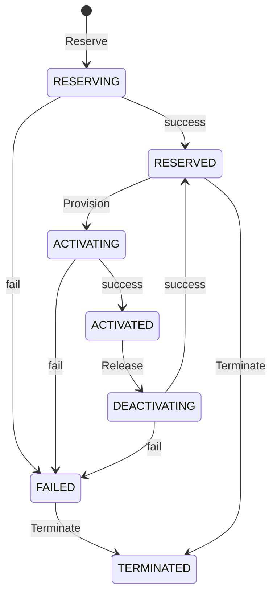
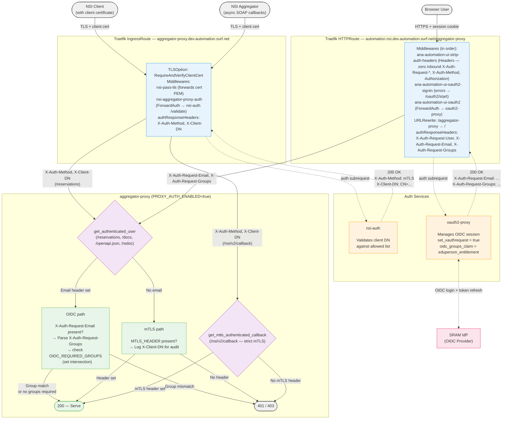
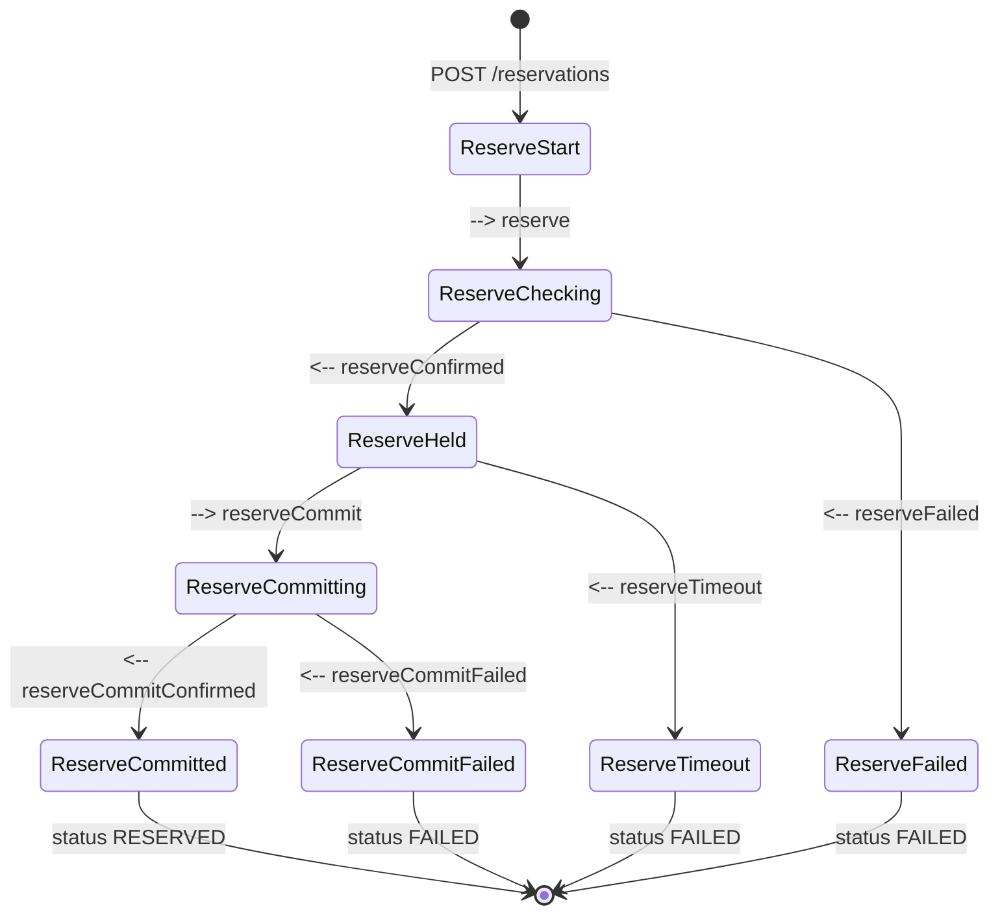
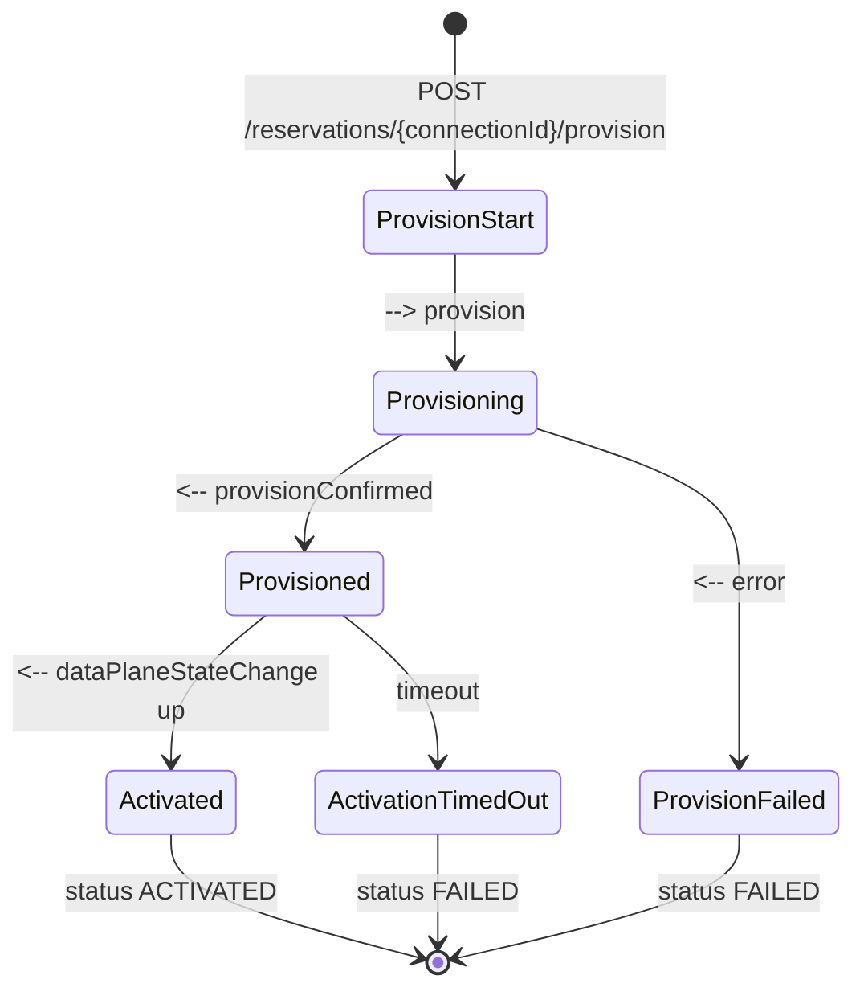
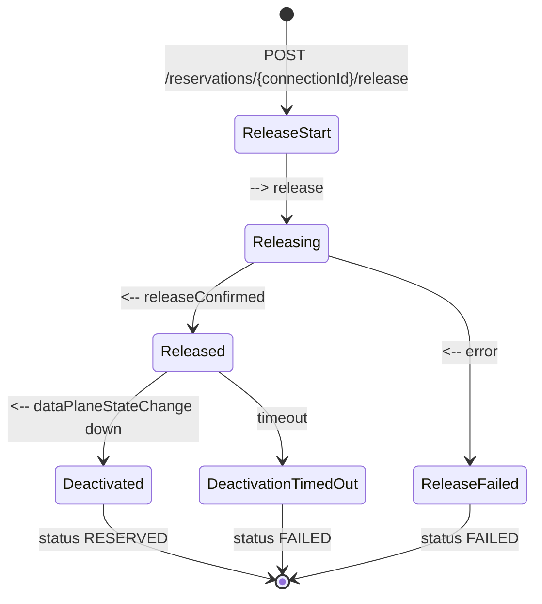
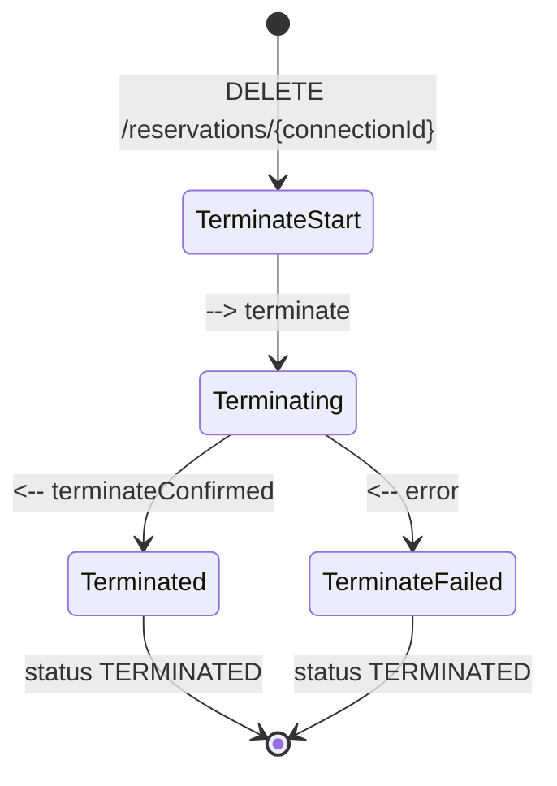

# NSI Aggregator Proxy

A REST API proxy that sits in front of an NSI (Network Service Interface) aggregator such as [Safnari](https://github.com/BandwidthOnDemand/nsi-safnari). Instead of requiring clients to implement the complex multi-state-machine NSI CS v2 SOAP protocol, this proxy exposes a simplified JSON/REST interface with a single connection state machine.

The proxy handles all NSI protocol complexity internally: it translates REST calls into NSI SOAP messages, manages asynchronous NSI callbacks, automatically commits reservations, tracks data plane state changes, and delivers results to a caller-specified callback URL.

## Project ANA-GRAM

This software is being developed by the 
[Advanced North-Atlantic Consortium](https://www.anaeng.global/), 
a cooperation between National Education and Research Networks (NRENs) and 
research partners to provide network connectivity for research and education 
across the North-Atlantic, as part of the ANA-GRAM (ANA Global Resource Aggregation Method) project. 

The goal of the ANA-GRAM project is to federate the ANA trans-Atlantic links through
[Network Service Interface (NSI)](https://ogf.org/documents/GFD.237.pdf)-based automation.
This will enable the automated provisioning of L2 circuits spanning different domains 
between research parties on other sides of the Atlantic. The ANA-GRAM project is 
spearheaded by the ANA Platform & Requirements Working Group, under guidance of the 
ANA Engineering and ANA Planning Groups.  

<p align="center" width="50%">
    
</p>

## Architecture

The diagram below shows the ANA-GRAM automation stack and how the NSI Aggregator Proxy fits into the broader architecture.

<p align="center">
    
</p>

**Color legend:**

| Color | Meaning |
|-------|---------|
| Purple | Existing software deployed in every participating network |
| Green | Existing NSI infrastructure software |
| Orange | Software being developed as part of ANA-GRAM |
| Yellow | Future software to be developed as part of ANA-GRAM |

**Components:**

- [**ANA Frontend**](https://github.com/workfloworchestrator) — Future management portal that will provide a comprehensive overview of all configured services on the ANA infrastructure, including real-time operational status information.
- [**NSI Orchestrator**](https://github.com/workfloworchestrator/nsi-orchestrator) — Central orchestration layer that manages the lifecycle of topologies, switching services, STPs, SDPs, and multi-domain connections. It uses the DDS Proxy for topology visibility and the NSI Aggregator Proxy as its Network Resource Manager.
- [**DDS Proxy**](https://github.com/workfloworchestrator/nsi-dds-proxy) — Fetches NML topology documents from the upstream DDS, parses them, and exposes the data as a JSON REST API for use by the NSI Orchestrator.
- [**NSI Aggregator Proxy**](https://github.com/workfloworchestrator/nsi-aggregator-proxy) (this repository) — Translates simple REST/JSON calls from the NSI Orchestrator into NSI Connection Service v2 SOAP messages toward the NSI Aggregator, abstracting NSI protocol complexity behind a linear state machine.
- [**DDS**](https://github.com/BandwidthOnDemand/nsi-dds) — The NSI Document Distribution Service, a distributed registry where networks publish and discover NML topology documents and NSA descriptions.
- [**PCE**](https://github.com/BandwidthOnDemand/nsi-pce) — The NSI Path Computation Element, which computes end-to-end paths across multiple network domains using topology information from the DDS.
- [**NSI Aggregator (Safnari)**](https://github.com/BandwidthOnDemand/nsi-safnari) — An NSI Connection Service v2.1 Aggregator that coordinates connection requests across multiple provider domains, using the PCE for path computation. The NSI Aggregator Proxy communicates with Safnari via NSI CS SOAP.
- [**SuPA**](https://github.com/workfloworchestrator/SuPA) — The SURF ultimate Provider Agent, an NSI Provider Agent that manages circuit reservation, creation, and removal within a single network domain. Uses gRPC instead of SOAP, and is always deployed together with [**PolyNSI**](https://github.com/workfloworchestrator/PolyNSI), a bidirectional SOAP-to-gRPC translation proxy.

## Simplified Connection State Machine

The proxy reduces the NSI protocol's multiple concurrent state machines (reservation, provision, lifecycle, data plane) into a single linear state machine:



| State | Description |
|---|---|
| `RESERVING` | Reserve request sent to the aggregator, waiting for confirmation and commit |
| `RESERVED` | Reservation committed and confirmed, ready to be provisioned or terminated |
| `ACTIVATING` | Provision request sent, waiting for data plane to come up |
| `ACTIVATED` | Data plane is active, connection is fully operational |
| `DEACTIVATING` | Release request sent, waiting for data plane to go down |
| `FAILED` | An error occurred; the connection can be terminated from this state |
| `TERMINATED` | Connection has been terminated; terminal state |

## Getting Started

### Prerequisites

- Python 3.13+
- [uv](https://docs.astral.sh/uv/) (recommended) for dependency management

### Running Locally with uv

```bash
# Install dependencies
uv sync

# Run the application
PROVIDER_URL=https://aggregator.example.com/nsi-v2/ConnectionServiceProvider \
  REQUESTER_NSA=urn:ogf:network:example.com:2025:requester-nsa \
  PROVIDER_NSA=urn:ogf:network:example.com:2025:provider-nsa \
  BASE_URL=https://proxy.example.com \
  uv run aggregator-proxy
```

The proxy starts on `http://0.0.0.0:8080` by default. On startup, it queries the aggregator for all existing reservations to populate its in-memory store.

### Running with Docker

```bash
# Build the image
docker build -t nsi-aggregator-proxy .

# Run the container
docker run -p 8080:8080 \
  -e PROVIDER_URL=https://aggregator.example.com/nsi-v2/ConnectionServiceProvider \
  -e REQUESTER_NSA=urn:ogf:network:example.com:2025:requester-nsa \
  -e PROVIDER_NSA=urn:ogf:network:example.com:2025:provider-nsa \
  -e BASE_URL=https://proxy.example.com \
  nsi-aggregator-proxy
```

For mTLS, mount the certificate files into the container and set the corresponding environment variables:

```bash
docker run -p 8080:8080 \
  -v /path/to/certs:/certs:ro \
  -e PROVIDER_URL=https://aggregator.example.com/nsi-v2/ConnectionServiceProvider \
  -e REQUESTER_NSA=urn:ogf:network:example.com:2025:requester-nsa \
  -e PROVIDER_NSA=urn:ogf:network:example.com:2025:provider-nsa \
  -e BASE_URL=https://proxy.example.com \
  -e CLIENT_CERT=/certs/client-certificate.pem \
  -e CLIENT_KEY=/certs/client-private-key.pem \
  -e CA_FILE=/certs/ca-bundle.pem \
  nsi-aggregator-proxy
```

### Deploying with Helm on Kubernetes

A Helm chart is included in the `chart/` directory.

```bash
helm install nsi-aggregator-proxy ./chart \
  --set env.PROVIDER_URL=https://aggregator.example.com/nsi-v2/ConnectionServiceProvider \
  --set env.REQUESTER_NSA=urn:ogf:network:example.com:2025:requester-nsa \
  --set env.PROVIDER_NSA=urn:ogf:network:example.com:2025:provider-nsa \
  --set env.BASE_URL=https://proxy.example.com
```

The chart supports Ingress and Gateway API HTTPRoute for external access, and the `envFromSecret` value lets you bind any environment variable to a Kubernetes Secret key (entries with an empty `secretName` are skipped, so the list can be safely templated per environment). See `chart/values.yaml` for all available options including mTLS certificate mounting via volumes and volume mounts.

## Configuration

All configuration is via plain environment variables (no prefix).

Alternatively, you can use the included `aggregator_proxy.env` file. Uncomment the variables you need and fill in the values. The file is read as UTF-8 on startup and must be in the current working directory (the directory from which you run the application). Environment variables take precedence over values in the env file.

### Required Variables

| Variable | Description |
|---|---|
| `PROVIDER_URL` | Full URL of the NSI provider endpoint on the aggregator (e.g. `https://safnari.example.com/nsi-v2/ConnectionServiceProvider`) |
| `REQUESTER_NSA` | NSA URN used as `requesterNSA` in query requests to the aggregator |
| `PROVIDER_NSA` | NSA URN of the aggregator; used as `providerNSA` in all outbound SOAP headers and validated against `providerNSA` in `POST /reservations` |
| `BASE_URL` | Externally reachable base URL of this proxy (e.g. `https://proxy.example.com`); `/nsi/v2/callback` is appended to form the `replyTo` address in outbound SOAP headers |

### Optional Variables

| Variable | Default | Description |
|---|---|---|
| `CLIENT_CERT` | — | Path to client TLS certificate for mTLS with the aggregator |
| `CLIENT_KEY` | — | Path to client TLS private key |
| `CA_FILE` | — | Path to CA bundle for server certificate verification |
| `NSI_TIMEOUT` | `180` | Seconds to wait for async NSI callbacks (reserve, commit, provision, release, terminate) |
| `DATAPLANE_TIMEOUT` | `300` | Seconds to wait for `DataPlaneStateChange` after provision or release |
| `LOG_LEVEL` | `INFO` | Log level (`DEBUG`, `INFO`, `WARNING`, `ERROR`) |
| `HOST` | `0.0.0.0` | Bind host |
| `PORT` | `8080` | Bind port |
| `ROOT_PATH` | _(empty)_ | ASGI root path prefix. Set when serving behind a reverse proxy that strips a path prefix (e.g. `/aggregator-proxy`). Ensures Swagger UI loads the OpenAPI spec from the correct URL. Does not affect route matching. |

### Authentication (optional)

The Aggregator Proxy authenticates requests by reading identity headers set by the edge proxy. Browser users authenticate at the portal via Traefik plus oauth2-proxy against an OIDC provider; the NSI aggregator and other machine clients authenticate via mutual TLS with an auth subrequest service (`nsi-auth`) that validates the certificate's DN. The proxy reads the resulting identity headers and applies an optional group check. Authentication is **disabled by default**; when enabled, requests that arrive without trusted identity headers are rejected with 401. `/health` is always unauthenticated. `/nsi/v2/callback` uses a stricter dependency that accepts only the mTLS header — browser/OIDC users are rejected even if they manage to reach the path.

#### Architecture

Two separate Traefik routes converge on the same aggregator-proxy instance:

- A **portal route** at `automation.nsi.dev.automation.surf.net/aggregator-proxy` that chains a Headers middleware (stripping inbound auth headers so clients can't self-attest), a ForwardAuth middleware to oauth2-proxy, and a URL-rewrite filter.
- An **mTLS IngressRoute** that enforces `RequireAndVerifyClientCert`, runs the `nsi-pass-tls` middleware to forward the cert, and chains the `nsi-aggregator-proxy-auth` ForwardAuth middleware to the `nsi-auth` validate sidecar.



#### Trust model

Authentication is performed at the edge; the proxy trusts the identity headers it receives. The cluster manifests must uphold the following invariants for that trust to hold:

- The portal HTTPRoute runs the `ana-automation-ui-strip-auth-headers` middleware **before** the ForwardAuth middleware, so a client cannot pre-set `X-Auth-Request-Email` / `-Groups` / `-Method`.
- The aggregator-proxy backend Service is `ClusterIP` and reachable only via the portal HTTPRoute or the mTLS IngressRoute.
- The mTLS route enforces `RequireAndVerifyClientCert` at the TLS layer.
- The `/nsi/v2/callback` dependency accepts only the mTLS header, so even a portal-authenticated user reaching that path through Traefik's path-prefix matching cannot deliver forged SOAP callbacks.

The destructive endpoints (`POST /reservations`, `POST /reservations/{id}/provision|release`, `DELETE /reservations/{id}`) are protected against cross-site CSRF by oauth2-proxy's session cookie `SameSite` attribute (default `Lax`). If the gateway is ever reconfigured to `SameSite=None` (e.g. for cross-domain embeds), the backend would need its own CSRF mitigation.

The application logs the authenticated identity and group membership for every request to support audit.

#### Defense-in-depth measures

| Measure | Purpose |
|---|---|
| **mTLS route enforces `RequireAndVerifyClientCert`** before nsi-auth runs | Only certificates signed by a trusted CA reach the auth service |
| **nsi-auth validates DN** against an allowed list | Even with a valid cert, only pre-approved clients are authorized |
| **Portal route's strip-auth-headers middleware** zeroes inbound `X-Auth-Request-*`, `X-Auth-Method`, `X-Client-DN`, and `Authorization` | Clients cannot self-attest by pre-setting trusted headers |
| **Network isolation** (backend Service is ClusterIP only) | Direct in-cluster access to the backend is required to bypass the edge |
| **Callback uses a strict-mTLS-only dependency** | OIDC users cannot forge async NSI callbacks even if Traefik routing puts them on `/nsi/v2/callback` |
| **`/health` is always unauthenticated** | k8s liveness/readiness probes succeed without credentials |

#### Header flow summary

| Header | Set by | Forwarded by | Consumed by |
|---|---|---|---|
| `X-Auth-Method` | nsi-auth (on 200) | Traefik IngressRoute (`authResponseHeaders`) | aggregator-proxy (mTLS auth on `/reservations` and `/nsi/v2/callback`) |
| `X-Client-DN` | nsi-auth (on 200) | Traefik IngressRoute (`authResponseHeaders`) | aggregator-proxy (audit logging) |
| `X-Auth-Request-Email` | oauth2-proxy (`set_xauthrequest = true`) | Traefik HTTPRoute (`authResponseHeaders`) | aggregator-proxy (identity) |
| `X-Auth-Request-Groups` | oauth2-proxy (`set_xauthrequest = true`, `oidc_groups_claim = eduperson_entitlement`) | Traefik HTTPRoute (`authResponseHeaders`) | aggregator-proxy (group authorization) |

#### Configuration

| Variable | Default | Description |
|---|---|---|
| `PROXY_AUTH_ENABLED` | `false` | Enable authentication on the data endpoints and on `/openapi.json` / `/docs` / `/redoc`. When `true`, every request to these paths must carry trusted identity headers (OIDC path) or the mTLS header, and must satisfy `OIDC_REQUIRED_GROUPS` when set. `/health` is always unauthenticated. The `/nsi/v2/callback` endpoint always uses a stricter mTLS-only check. |
| `MTLS_HEADER` | _(empty)_ | Header name that nsi-auth sets on successful validation (e.g. `X-Auth-Method`). When set and auth is enabled, the presence of this header counts as mTLS authentication. nsi-auth also sets `X-Client-DN`, which is logged for audit purposes. |
| `OIDC_REQUIRED_GROUPS` | `[]` | Groups required for OIDC-authenticated access. Supports comma-separated (`g1,g2`) or JSON array (`["g1","g2"]`). Use `[]` for no group check (any authenticated user is allowed). Matched against the parsed `X-Auth-Request-Groups` header (comma- or whitespace-separated). **When MCP is enabled this list must also contain the group URNs returned by the MCP IdP** — a single list gates both surfaces. **Note:** pydantic-settings JSON-parses `list` env vars, so an empty string will cause a startup error — always use `[]` instead. |

**Authentication flow** when `PROXY_AUTH_ENABLED=true`:

1. **OIDC path** (`/reservations`, `/docs`, `/openapi.json`, `/redoc`): If `X-Auth-Request-Email` is present, the request is authenticated. If `OIDC_REQUIRED_GROUPS` is non-empty, the user's `X-Auth-Request-Groups` must intersect with the required groups; otherwise 403.
2. **mTLS path** (`/reservations` when `MTLS_HEADER` is set): If the configured header is present, the request is authenticated. The client certificate DN from `X-Client-DN` is logged for audit.
3. **Callback** (`/nsi/v2/callback`): Strict mTLS only. The `MTLS_HEADER` must be present; OIDC headers are never accepted on this path.
4. **Neither**: If no trusted identity is present, the request is rejected with 401.

#### Error responses

| Status | Detail | Cause |
|---|---|---|
| `401` | `Authentication required` | No trusted identity headers and no mTLS header found on `/reservations` (or `/docs` / `/openapi.json` / `/redoc`) |
| `401` | `mTLS authentication required` | No mTLS header on `/nsi/v2/callback` |
| `403` | `Insufficient group membership` | User not in any of the required groups |

## MCP Endpoint (optional)

The Aggregator Proxy can expose its read-only reservation endpoints as a [Model Context Protocol](https://modelcontextprotocol.io) (MCP) server, mounted at `/mcp`. This lets AI agents (Claude Desktop, custom agents using `fastmcp.Client`, etc.) list and inspect reservations via MCP **Tools**.

Only the two GET operations are exposed, both as Tools (the surface every MCP client supports, including Claude Desktop):

- `GET /reservations` → MCP Tool `list_reservations`
- `GET /reservations/{connectionId}` → MCP Tool `get_reservation` (takes a `connectionId` argument)

All state-changing operations (POST, DELETE) and the NSI callback endpoint are explicitly excluded from MCP.

### Configuration

| Variable | Default | Description |
|---|---|---|
| `MCP_ENABLED` | `false` | Mount the MCP sub-app. Opt-in; the feature is disabled by default. |
| `MCP_PATH` | `/mcp` | Mount path for the MCP sub-app. Must start with `/` and must not end with `/`. |
| `MCP_AUTH_ENABLED` | `false` | Validate incoming MCP JWTs via `fastmcp.JWTVerifier`. **Must be `true` whenever `PROXY_AUTH_ENABLED=true` and `MCP_ENABLED=true`** (the Settings model validator refuses the unsafe combination at startup). |
| `MCP_OIDC_JWKS_URI` | _(empty)_ | JWKS URI for the MCP OIDC provider (separate from the portal IdP). |
| `MCP_OIDC_ISSUER` | _(empty)_ | Expected `iss` claim for MCP-issued JWTs. |
| `MCP_OIDC_AUDIENCE` | _(empty)_ | Expected `aud` claim for MCP-issued JWTs. |
| `MCP_OIDC_EMAIL_CLAIM` | `email` | Claim name read from the MCP JWT and forwarded as `X-Auth-Request-Email` on the internal MCP→REST call. |
| `MCP_OIDC_GROUPS_CLAIM` | `groups` | Claim name read from the MCP JWT and forwarded as `X-Auth-Request-Groups` on the internal MCP→REST call. |

**MCP as a local gateway.** When an AI agent calls an MCP tool that maps to `GET /reservations`, fastmcp validates the JWT (signature/issuer/audience/expiry) and then makes an internal HTTP call to the REST handler. An httpx event hook (`_forward_user_identity`) decodes the validated JWT's payload, reads the email and groups claims (names configured via `MCP_OIDC_EMAIL_CLAIM` / `MCP_OIDC_GROUPS_CLAIM`), and sets `X-Auth-Request-Email` and `X-Auth-Request-Groups` on the internal request. `Authorization` is dropped on the internal call. REST then runs the same `get_authenticated_user` dependency as the portal path — so the group check against `OIDC_REQUIRED_GROUPS` enforces the same policy for both surfaces. For this to work, `OIDC_REQUIRED_GROUPS` must include the MCP IdP's group URNs alongside the portal's.

**Startup validation.** The Settings model refuses to construct when `PROXY_AUTH_ENABLED=true` *and* `MCP_ENABLED=true` *and* `MCP_AUTH_ENABLED=false`. In that combination fastmcp wouldn't validate the JWT and the claim-translation hook would forward attacker-supplied claims as trusted REST headers — a privilege-escalation path. Fail fast at startup with a clear error message instead.

### Minimal client example

```python
from fastmcp import Client
from fastmcp.client.transports import StreamableHttpTransport

transport = StreamableHttpTransport(
    url="https://proxy.example.com/mcp/",
    headers={"Authorization": "Bearer <your-token>"},
)

async with Client(transport) as client:
    # List all reservations
    result = await client.call_tool("list_reservations")
    print(result.data)

    # Or fetch a single reservation by connection ID
    result = await client.call_tool("get_reservation", {"connectionId": "<your-connection-id>"})
    print(result.data)
```

## API Endpoints

### POST /reservations

Reserve a connection. On acceptance the reservation transitions to `RESERVING`. The proxy sends the NSI `reserve` request, waits for `reserveConfirmed`, automatically sends `reserveCommit`, waits for `reserveCommitConfirmed`, and delivers the final result (`RESERVED` or `FAILED`) to the `callbackURL`.

#### Request Body

All fields are required except `globalReservationId` and `serviceType`.

```json
{
  "globalReservationId": "urn:uuid:5fa943ae-32e8-4faa-9080-0bbdc0f405e8",
  "description": "My first multi domain connection",
  "criteria": {
    "serviceType": "http://services.ogf.org/nsi/2013/12/descriptions/EVTS.A-GOLE",
    "p2ps": {
      "capacity": 1000,
      "sourceSTP": "urn:ogf:network:x.domain.toplevel:2020:topology:ps1?vlan=1790",
      "destSTP": "urn:ogf:network:y.domain.toplevel:2025:topology:ps2?vlan=1790"
    }
  },
  "requesterNSA": "urn:ogf:network:y.domain.toplevel:2021:requester",
  "providerNSA": "urn:ogf:network:nsi.example.domain:2025:nsa:safnari",
  "callbackURL": "https://orchestrator.example.domain/callback"
}
```

| Field | Type | Required | Description |
|---|---|---|---|
| `globalReservationId` | string | No | UUID URN (`urn:uuid:...`) to identify the reservation globally |
| `description` | string | Yes | Human-readable description of the connection |
| `criteria.serviceType` | string | No | NSI service type URN; defaults to `EVTS.A-GOLE` |
| `criteria.p2ps.capacity` | integer | Yes | Requested capacity in Mbit/s (must be > 0) |
| `criteria.p2ps.sourceSTP` | string | Yes | Source Service Termination Point (Network URN) |
| `criteria.p2ps.destSTP` | string | Yes | Destination Service Termination Point (Network URN) |
| `requesterNSA` | string | Yes | NSA URN of the requesting party |
| `providerNSA` | string | Yes | NSA URN of the target aggregator; must match `PROVIDER_NSA` |
| `callbackURL` | string | Yes | URL where the reservation result will be delivered |

#### Response

See [API Responses](#api-responses).

#### Internal NSI Flow



### POST /reservations/{connectionId}/provision

Provision a reserved connection to activate the data plane. Only allowed when the reservation is in the `RESERVED` state. On acceptance it transitions to `ACTIVATING`. The proxy waits for `provisionConfirmed` and then `DataPlaneStateChange(active=True)`, delivering the final result (`ACTIVATED` or `FAILED`) to the `callbackURL`.

#### Request Body

```json
{
  "callbackURL": "https://orchestrator.example.domain/callback"
}
```

#### Response

See [API Responses](#api-responses).

#### Internal NSI Flow



### POST /reservations/{connectionId}/release

Release an activated connection to deactivate the data plane. Only allowed when the reservation is in the `ACTIVATED` state. On acceptance it transitions to `DEACTIVATING`. The proxy waits for `releaseConfirmed` and then `DataPlaneStateChange(active=False)`, delivering the final result (`RESERVED` or `FAILED`) to the `callbackURL`.

#### Request Body

```json
{
  "callbackURL": "https://orchestrator.example.domain/callback"
}
```

#### Response

See [API Responses](#api-responses).

#### Internal NSI Flow



### DELETE /reservations/{connectionId}

Terminate a connection. Only allowed when the reservation is in the `RESERVED` or `FAILED` state. Both successful termination and timeout result in the `TERMINATED` state.

#### Request Body

```json
{
  "callbackURL": "https://orchestrator.example.domain/callback"
}
```

#### Response

See [API Responses](#api-responses).

#### Internal NSI Flow



### GET /reservations/{connectionId}

Get the details of a single reservation. Before returning, the proxy queries the aggregator via `querySummarySync` and `queryNotificationSync` to ensure the state is up to date.

#### Query Parameters

| Parameter | Type | Default | Description |
|---|---|---|---|
| `detail` | string | `summary` | Level of path segment detail: `summary` (no segments), `full` (segments from `querySummarySync`), or `recursive` (segments with per-segment status via async `queryRecursive`) |

#### Response

```json
{
  "globalReservationId": "urn:uuid:5fa943ae-32e8-4faa-9080-0bbdc0f405e8",
  "connectionId": "9adfed42-fa58-4d26-bf74-9f5e14ab2281",
  "description": "My first multi domain connection",
  "criteria": {
    "version": 1,
    "serviceType": "http://services.ogf.org/nsi/2013/12/descriptions/EVTS.A-GOLE",
    "p2ps": {
      "capacity": 1000,
      "sourceSTP": "urn:ogf:network:x.domain.toplevel:2020:topology:ps1?vlan=1790",
      "destSTP": "urn:ogf:network:y.domain.toplevel:2025:topology:ps2?vlan=1790"
    }
  },
  "status": "ACTIVATED",
  "lastError": null,
  "segments": [
    {
      "order": 0,
      "connectionId": "child-seg-0",
      "providerNSA": "urn:ogf:network:west.example.net:2025:nsa:supa",
      "serviceType": "http://services.ogf.org/nsi/2013/12/descriptions/EVTS.A-GOLE",
      "capacity": 1000,
      "sourceSTP": "urn:ogf:network:west.example.net:2025:port-a?vlan=100",
      "destSTP": "urn:ogf:network:west.example.net:2025:port-b?vlan=200",
      "status": "ACTIVATED"
    }
  ]
}
```

| Field | Type | Description |
|---|---|---|
| `globalReservationId` | string or null | The global reservation identifier, if one was provided at creation |
| `connectionId` | string | The connection identifier assigned by the aggregator |
| `description` | string | Human-readable description |
| `criteria` | object or null | Reservation criteria including version, service type, and point-to-point parameters |
| `status` | string | Current state: `RESERVING`, `RESERVED`, `ACTIVATING`, `ACTIVATED`, `DEACTIVATING`, `FAILED`, or `TERMINATED` |
| `lastError` | string or null | Human-readable description of the most recent error, if any |
| `segments` | array or null | Path segments (child connections); only present when `detail=full` or `detail=recursive`. Each segment has `order`, `connectionId`, `providerNSA`, `serviceType`, `capacity`, `sourceSTP`, `destSTP`, and `status` (only with `detail=recursive`). |

### GET /reservations

List all reservations. The proxy queries the aggregator to refresh all reservation states before returning.

#### Query Parameters

| Parameter | Type | Default | Description |
|---|---|---|---|
| `detail` | string | `summary` | Level of path segment detail: `summary` (no segments) or `full` (segments from `querySummarySync`). `recursive` is not supported on the list endpoint and returns 400. |

#### Response

```json
{
  "reservations": [
    {
      "globalReservationId": "urn:uuid:5fa943ae-32e8-4faa-9080-0bbdc0f405e8",
      "connectionId": "9adfed42-fa58-4d26-bf74-9f5e14ab2281",
      "description": "My first multi domain connection",
      "criteria": {
        "version": 1,
        "serviceType": "http://services.ogf.org/nsi/2013/12/descriptions/EVTS.A-GOLE",
        "p2ps": {
          "capacity": 1000,
          "sourceSTP": "urn:ogf:network:x.domain.toplevel:2020:topology:ps1?vlan=1790",
          "destSTP": "urn:ogf:network:y.domain.toplevel:2025:topology:ps2?vlan=1790"
        }
      },
      "status": "ACTIVATED",
      "lastError": null,
      "segments": null
    }
  ]
}
```

### GET /health

Liveness probe endpoint. Returns `200 OK` with an empty body. Access logs for this endpoint are suppressed.

## API Responses

### Accepted (202)

Returned by `POST /reservations`, `POST .../provision`, `POST .../release`, and `DELETE .../`. The request has been accepted and the operation is in progress. The final result will be delivered to the `callbackURL`.

```json
{
  "type": "https://github.com/workfloworchestrator/nsi-aggregator-proxy#202-accepted",
  "title": "Accepted",
  "status": 202,
  "detail": "The request is accepted.",
  "instance": "/reservations/9adfed42-fa58-4d26-bf74-9f5e14ab2281"
}
```

### Bad Request (400)

The JSON is syntactically broken, or the `providerNSA` does not match the configured value.

```json
{
  "type": "https://github.com/workfloworchestrator/nsi-aggregator-proxy#400-bad-request",
  "title": "Bad Request",
  "status": 400,
  "detail": "The JSON is syntactically broken.",
  "path": "/reservations"
}
```

### Not Found (404)

The `connectionId` does not exist in the store or on the aggregator.

### Conflict (409)

The reservation is not in the required state for the requested operation (e.g. trying to provision a connection that is not `RESERVED`).

### Unsupported Media Type (415)

Only JSON payloads are accepted. Set the `Content-Type` header to `application/json`.

```json
{
  "type": "https://github.com/workfloworchestrator/nsi-aggregator-proxy#415-unsupported-media-type",
  "title": "Unsupported Media Type",
  "status": 415,
  "detail": "Only application/json with UTF-8 encoding is supported.",
  "path": "/reservations"
}
```

### Unprocessable Entity (422)

The payload is valid JSON but contains invalid data (e.g. malformed STP URN, negative capacity).

```json
{
  "type": "https://github.com/workfloworchestrator/nsi-aggregator-proxy#422-unprocessable-entity",
  "title": "Unprocessable Entity",
  "status": 422,
  "detail": "The STP cannot be found in any of the known topologies.",
  "instance": "/reservations/5fa943ae",
  "errors": [
    {
      "field": "sourceSTP",
      "reason": "STP 'urn:ogf:network:x.domain.toplevel:2020:topology:ps1?vlan=1790' not found."
    }
  ]
}
```

### Bad Gateway (502)

The proxy could not reach the NSI aggregator, or the aggregator returned an unexpected response.

## Callback Payload

When an operation completes (or fails), the proxy sends a POST request to the `callbackURL` with a JSON body identical to the response from `GET /reservations/{connectionId}`:

```json
{
  "globalReservationId": "urn:uuid:5fa943ae-32e8-4faa-9080-0bbdc0f405e8",
  "connectionId": "9adfed42-fa58-4d26-bf74-9f5e14ab2281",
  "description": "My first multi domain connection",
  "criteria": {
    "version": 1,
    "serviceType": "http://services.ogf.org/nsi/2013/12/descriptions/EVTS.A-GOLE",
    "p2ps": {
      "capacity": 1000,
      "sourceSTP": "urn:ogf:network:x.domain.toplevel:2020:topology:ps1?vlan=1790",
      "destSTP": "urn:ogf:network:y.domain.toplevel:2025:topology:ps2?vlan=1790"
    }
  },
  "status": "RESERVED",
  "lastError": null,
  "segments": null
}
```

When the status is `FAILED`, the `lastError` field contains a human-readable description of the error, including NSI `ServiceException` details when available.

## Error Events

Error events (`activateFailed`, `deactivateFailed`, `dataplaneError`, `forcedEnd`) from the aggregator are detected via `queryNotificationSync` during state refresh. These can cause the status to become `FAILED` even when the NSI sub-state machines appear normal. The `lastError` field contains a human-readable description of the most recent error event.

## State Mapping from NSI

The proxy maps the NSI sub-state machines (reservation, provision, lifecycle, data plane) to the simplified proxy state using the following priority order:

| Priority | NSI Condition | Proxy State |
|---|---|---|
| 1 | Lifecycle = `Terminated` or `PassedEndTime` | `TERMINATED` |
| 2 | Lifecycle = `Failed` | `FAILED` |
| 3 | Reservation = `ReserveTimeout`, `ReserveFailed`, or `ReserveAborting` | `FAILED` |
| 4 | Error events detected (`activateFailed`, `deactivateFailed`, etc.) | `FAILED` |
| 5 | Reservation = `ReserveChecking`, `ReserveHeld`, or `ReserveCommitting` | `RESERVING` |
| 6 | Provision = `Released` and data plane active | `DEACTIVATING` |
| 7 | Data plane active | `ACTIVATED` |
| 8 | Provision = `Provisioned` (data plane not yet active) | `ACTIVATING` |
| 9 | Otherwise | `RESERVED` |

## Development

```bash
# Install dependencies (including dev tools)
uv sync

# Run tests
uv run pytest

# Run a single test
uv run pytest tests/path/to/test_file.py::test_function_name

# Lint
uv run ruff check .

# Format
uv run ruff format .

# Type check
uv run mypy aggregator_proxy
```

## License

Apache-2.0
