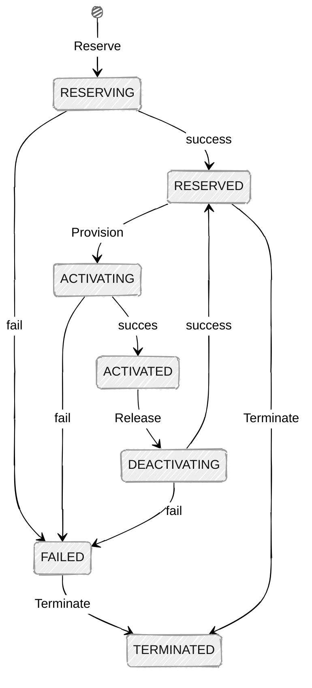

# NSI Aggregator Proxy

The NSI Aggregator Proxy offers a REST API to a single, simplified connection
state machine, this in contrast with the multiple state machines needed to keep
track of the NSI connection state. This proxy allows to reserve, provision,
release and terminate a connection, and list all connections including details.

## Connection State Machine

In the diagram below, the connection state machine is described. The Reserve,
Provision, Release and Terminate actions map to the API endpoints described
below.



## API Endpoints

### POST /reservations

Reserve a connection using the parameters from the input payload. When the
request is accepted, the reservations transitions to the `RESERVING` state. The
result of the request will be sent to `callbackURL`, and the reservation will
either transition to the `RESERVED` or the `FAILED` state.

### Input

Only the `description`, `capacity`, `sourceSTP`, `destSTP` and `callbackURL`
fields are mandatory. 

```json
{
  "globalReservationId": "urn:uuid:5fa943ae-32e8-4faa-9080-0bbdc0f405e8",
  "description": "My first multi domain connection",
  "criteria": {
    "serviceType": "http://services.ogf.org/nsi/2013/12/descriptions/EVTS.A-GOLE",
    "p2ps": {
      "capacity": 1000,
      "directionality": "Bidirectional",
      "symmetricPath": true,
      "sourceSTP": "urn:ogf:network:x.domain.toplevel:2020:topology:ps1?vlan=1790",
      "destSTP": "urn:ogf:network:y.domain.toplevel:2025:topology:ps2?vlan=1790"
    }
  },
  "callbackURL": "https://orchestrator.example.domain/callback"
}
```

### Response

See [responses](#responses).

## POST /reservations/{connectionId}/provision

Provision a connection identified by connectionId, this is only allowed when
the reservation is in the `RESERVED` state. When the request is accepted, the
reservations transitions to the `ACTIVATING` state. The result of the request
will be sent to `callbackURL`, and the reservation will either transition to
the `ACTIVATED` or the `FAILED` state.

### Input

```json
{
  "callbackURL": "https://orchestrator.example.domain/callback"
}
```

### Response

See [responses](#responses).

## POST /reservations/{connection_id}/release

Release a connection identiefied by conection_id.  this is only allowed when
the reservation is in the `ACTIVATED` state. When the request is accepted, the
reservations transitions to the `DEACTIVATING` state. The result of the request
will be sent to `callbackURL`, and the reservation will either transition to
the `RESERVED` or the `FAILED` state.

### Input

```json
{
  "callbackURL": "https://orchestrator.example.domain/callback"
}
```

### Response

See [responses](#responses).

DELETE /reservations/{connection_id}

Terminate a reserved connection identiefied by conection_id.  this is only
allowed when the reservation is in the `RESERVED` or `FAILED` state. When the
request is accepted, the reservations transitions to the `TERMINATED` state.

### Input

```json
{
  "callbackURL": "https://orchestrator.example.domain/callback"
}
```

### Response

See [responses](#responses).

## GET /reservations

Get a list of all reservations.

### Response

```json
{
  "reservations": 
    [
      {
        "globalReservationId": "urn:uuid:5fa943ae-32e8-4faa-9080-0bbdc0f405e8"
        "description": "My first multi domain connection",
        "criteria": {
          "serviceType": "http://services.ogf.org/nsi/2013/12/descriptions/EVTS.A-GOLE",
          "p2ps": {
            "capacity": 1000,
            "directionality": "Bidirectional",
            "symmetricPath": true,
            "sourceSTP": "urn:ogf:network:x.domain.toplevel:2020:topology:ps1?vlan=1790",
            "destSTP": "urn:ogf:network:y.domain.toplevel:2025:topology:ps2?vlan=1790"
          }
        },
        "status": "ACTIVATED"
      }
    ]
}
```

## Responses

### 202 Accepted

The request is syntactically correct, passed the initial validation of the
payload, and has been accepted. The result of the request will be send to
`callbackURL`.

```json
{
  "type": "https://github.com/workfloworchestrator/nsi-aggregator-proxy#202-accepted",
  "title": "Accepted",
  "status": 202,
  "detail": "The request is accepted.",
  "instance": "/reservations/9adfed42-fa58-4d26-bf74-9f5e14ab2281"
}
```

### 400 Bad Request

The JSON is syntactically broken (e.g., a missing comma, unclosed brace, or
invalid characters).

```json
{
  "type": "https://github.com/workfloworchestrator/nsi-aggregator-proxy#202-bad-request",
  "title": "Bad Request",
  "status": 400,
  "detail": "The JSON is syntactically broken.",
  "path": "/reservations"
}
```

### 415 Unsupported Media Type

Only JSON payload is accepted, set the Content-Type header to application/json.

```json
{
  "type": "https://github.com/workfloworchestrator/nsi-aggregator-proxy#415-unsupported-media-type",
  "title": "Unsupported Media Type",
  "status": 415,
  "detail": "Only application/json is supported.",
  "path": "/reservations"
}
```

### 422 Unprocessable Entity

The payload contains invalid data, for example, the sourceSTP is unknown, or
the capacity is a negative number.

```json
{
  "type": "https://github.com/workfloworchestrator/nsi-aggregator-proxy#422-unprocessable-entity",
  "title": "Unprocessable Entity",
  "status": 422,
  "detail": "The STP cannot be found in any of the know topologies.",
  "instance": "/reservations/5fa943ae",
  "errors": [
    {
      "field": "sourceSTP",
      "reason": "STP 'urn:ogf:network:x.domain.toplevel:2020:topology:ps1?vlan=1790' not found."
    }
  ]
}
```
