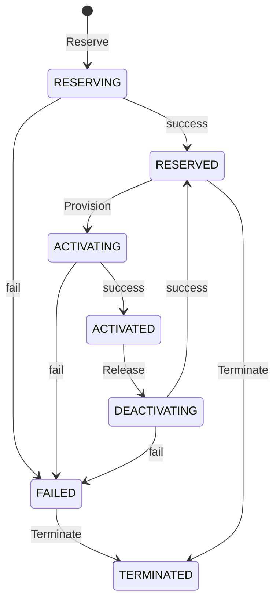
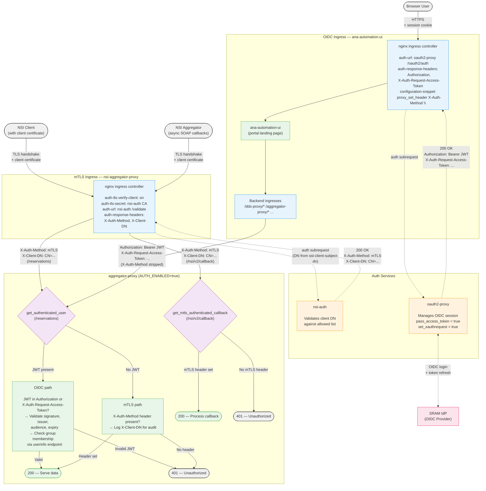
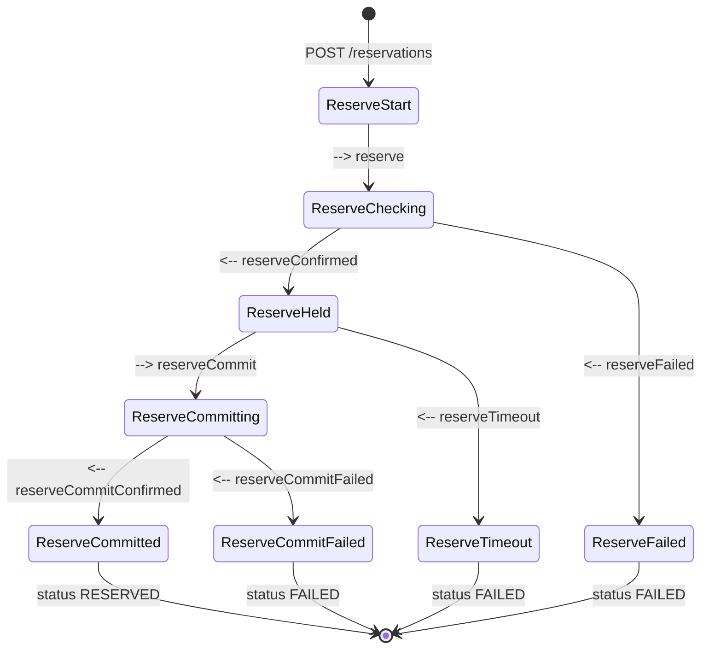
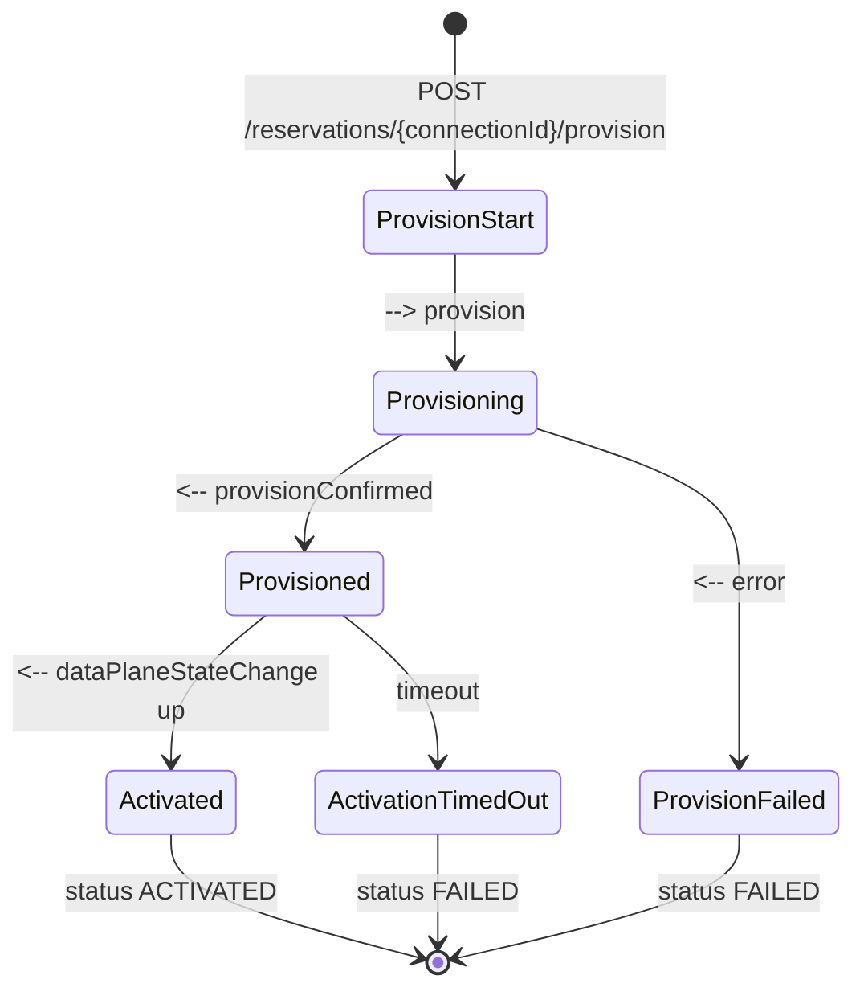
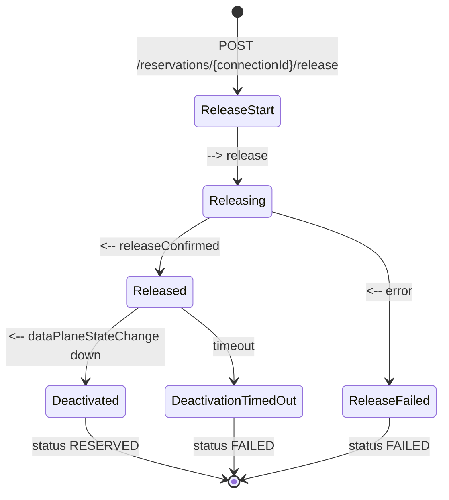
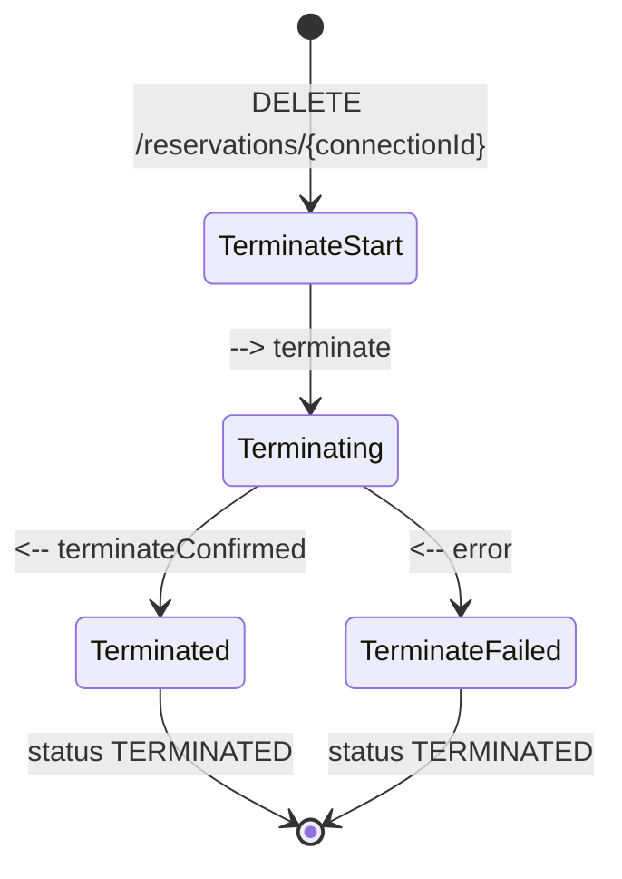

# NSI Aggregator Proxy

A REST API proxy that sits in front of an NSI (Network Service Interface) aggregator such as [Safnari](https://github.com/BandwidthOnDemand/nsi-safnari). Instead of requiring clients to implement the complex multi-state-machine NSI CS v2 SOAP protocol, this proxy exposes a simplified JSON/REST interface with a single connection state machine.

The proxy handles all NSI protocol complexity internally: it translates REST calls into NSI SOAP messages, manages asynchronous NSI callbacks, automatically commits reservations, tracks data plane state changes, and delivers results to a caller-specified callback URL.

## Project ANA-GRAM

This software is being developed by the 
[Advanced North-Atlantic Consortium](https://www.anaeng.global/), 
a cooperation between National Education and Research Networks (NRENs) and 
research partners to provide network connectivity for research and education 
across the North-Atlantic, as part of the ANA-GRAM (ANA Global Resource Aggregation Method) project. 

The goal of the ANA-GRAM project is to federate the ANA trans-Atlantic links through
[Network Service Interface (NSI)](https://ogf.org/documents/GFD.237.pdf)-based automation.
This will enable the automated provisioning of L2 circuits spanning different domains 
between research parties on other sides of the Atlantic. The ANA-GRAM project is 
spearheaded by the ANA Platform & Requirements Working Group, under guidance of the 
ANA Engineering and ANA Planning Groups.  

<p align="center" width="50%">
    
</p>

## Architecture

The diagram below shows the ANA-GRAM automation stack and how the NSI Aggregator Proxy fits into the broader architecture.

<p align="center">
    
</p>

**Color legend:**

| Color | Meaning |
|-------|---------|
| Purple | Existing software deployed in every participating network |
| Green | Existing NSI infrastructure software |
| Orange | Software being developed as part of ANA-GRAM |
| Yellow | Future software to be developed as part of ANA-GRAM |

**Components:**

- [**ANA Frontend**](https://github.com/workfloworchestrator) — Future management portal that will provide a comprehensive overview of all configured services on the ANA infrastructure, including real-time operational status information.
- [**NSI Orchestrator**](https://github.com/workfloworchestrator/nsi-orchestrator) — Central orchestration layer that manages the lifecycle of topologies, switching services, STPs, SDPs, and multi-domain connections. It uses the DDS Proxy for topology visibility and the NSI Aggregator Proxy as its Network Resource Manager.
- [**DDS Proxy**](https://github.com/workfloworchestrator/nsi-dds-proxy) — Fetches NML topology documents from the upstream DDS, parses them, and exposes the data as a JSON REST API for use by the NSI Orchestrator.
- [**NSI Aggregator Proxy**](https://github.com/workfloworchestrator/nsi-aggregator-proxy) (this repository) — Translates simple REST/JSON calls from the NSI Orchestrator into NSI Connection Service v2 SOAP messages toward the NSI Aggregator, abstracting NSI protocol complexity behind a linear state machine.
- [**DDS**](https://github.com/BandwidthOnDemand/nsi-dds) — The NSI Document Distribution Service, a distributed registry where networks publish and discover NML topology documents and NSA descriptions.
- [**PCE**](https://github.com/BandwidthOnDemand/nsi-pce) — The NSI Path Computation Element, which computes end-to-end paths across multiple network domains using topology information from the DDS.
- [**NSI Aggregator (Safnari)**](https://github.com/BandwidthOnDemand/nsi-safnari) — An NSI Connection Service v2.1 Aggregator that coordinates connection requests across multiple provider domains, using the PCE for path computation. The NSI Aggregator Proxy communicates with Safnari via NSI CS SOAP.
- [**SuPA**](https://github.com/workfloworchestrator/SuPA) — The SURF ultimate Provider Agent, an NSI Provider Agent that manages circuit reservation, creation, and removal within a single network domain. Uses gRPC instead of SOAP, and is always deployed together with [**PolyNSI**](https://github.com/workfloworchestrator/PolyNSI), a bidirectional SOAP-to-gRPC translation proxy.

## Simplified Connection State Machine

The proxy reduces the NSI protocol's multiple concurrent state machines (reservation, provision, lifecycle, data plane) into a single linear state machine:



| State | Description |
|---|---|
| `RESERVING` | Reserve request sent to the aggregator, waiting for confirmation and commit |
| `RESERVED` | Reservation committed and confirmed, ready to be provisioned or terminated |
| `ACTIVATING` | Provision request sent, waiting for data plane to come up |
| `ACTIVATED` | Data plane is active, connection is fully operational |
| `DEACTIVATING` | Release request sent, waiting for data plane to go down |
| `FAILED` | An error occurred; the connection can be terminated from this state |
| `TERMINATED` | Connection has been terminated; terminal state |

## Getting Started

### Prerequisites

- Python 3.13+
- [uv](https://docs.astral.sh/uv/) (recommended) for dependency management

### Running Locally with uv

```bash
# Install dependencies
uv sync

# Run the application
AGGREGATOR_PROXY_PROVIDER_URL=https://aggregator.example.com/nsi-v2/ConnectionServiceProvider \
  AGGREGATOR_PROXY_REQUESTER_NSA=urn:ogf:network:example.com:2025:requester-nsa \
  AGGREGATOR_PROXY_PROVIDER_NSA=urn:ogf:network:example.com:2025:provider-nsa \
  AGGREGATOR_PROXY_BASE_URL=https://proxy.example.com \
  uv run aggregator-proxy
```

The proxy starts on `http://0.0.0.0:8080` by default. On startup, it queries the aggregator for all existing reservations to populate its in-memory store.

### Running with Docker

```bash
# Build the image
docker build -t nsi-aggregator-proxy .

# Run the container
docker run -p 8080:8080 \
  -e AGGREGATOR_PROXY_PROVIDER_URL=https://aggregator.example.com/nsi-v2/ConnectionServiceProvider \
  -e AGGREGATOR_PROXY_REQUESTER_NSA=urn:ogf:network:example.com:2025:requester-nsa \
  -e AGGREGATOR_PROXY_PROVIDER_NSA=urn:ogf:network:example.com:2025:provider-nsa \
  -e AGGREGATOR_PROXY_BASE_URL=https://proxy.example.com \
  nsi-aggregator-proxy
```

For mTLS, mount the certificate files into the container and set the corresponding environment variables:

```bash
docker run -p 8080:8080 \
  -v /path/to/certs:/certs:ro \
  -e AGGREGATOR_PROXY_PROVIDER_URL=https://aggregator.example.com/nsi-v2/ConnectionServiceProvider \
  -e AGGREGATOR_PROXY_REQUESTER_NSA=urn:ogf:network:example.com:2025:requester-nsa \
  -e AGGREGATOR_PROXY_PROVIDER_NSA=urn:ogf:network:example.com:2025:provider-nsa \
  -e AGGREGATOR_PROXY_BASE_URL=https://proxy.example.com \
  -e AGGREGATOR_PROXY_CLIENT_CERT=/certs/client-certificate.pem \
  -e AGGREGATOR_PROXY_CLIENT_KEY=/certs/client-private-key.pem \
  -e AGGREGATOR_PROXY_CA_FILE=/certs/ca-bundle.pem \
  nsi-aggregator-proxy
```

### Deploying with Helm on Kubernetes

A Helm chart is included in the `chart/` directory.

```bash
helm install nsi-aggregator-proxy ./chart \
  --set env.AGGREGATOR_PROXY_PROVIDER_URL=https://aggregator.example.com/nsi-v2/ConnectionServiceProvider \
  --set env.AGGREGATOR_PROXY_REQUESTER_NSA=urn:ogf:network:example.com:2025:requester-nsa \
  --set env.AGGREGATOR_PROXY_PROVIDER_NSA=urn:ogf:network:example.com:2025:provider-nsa \
  --set env.AGGREGATOR_PROXY_BASE_URL=https://proxy.example.com
```

The chart supports Ingress and Gateway API HTTPRoute for external access, and the `envFromSecret` value lets you bind any `AGGREGATOR_PROXY_*` environment variable to a Kubernetes Secret key (entries with an empty `secretName` are skipped, so the list can be safely templated per environment). See `chart/values.yaml` for all available options including mTLS certificate mounting via volumes and volume mounts.

## Configuration

All configuration is via environment variables with the `AGGREGATOR_PROXY_` prefix.

Alternatively, you can use the included `aggregator_proxy.env` file. Uncomment the variables you need and fill in the values. The file is read as UTF-8 on startup and must be in the current working directory (the directory from which you run the application). Environment variables take precedence over values in the env file.

### Required Variables

| Variable | Description |
|---|---|
| `AGGREGATOR_PROXY_PROVIDER_URL` | Full URL of the NSI provider endpoint on the aggregator (e.g. `https://safnari.example.com/nsi-v2/ConnectionServiceProvider`) |
| `AGGREGATOR_PROXY_REQUESTER_NSA` | NSA URN used as `requesterNSA` in query requests to the aggregator |
| `AGGREGATOR_PROXY_PROVIDER_NSA` | NSA URN of the aggregator; used as `providerNSA` in all outbound SOAP headers and validated against `providerNSA` in `POST /reservations` |
| `AGGREGATOR_PROXY_BASE_URL` | Externally reachable base URL of this proxy (e.g. `https://proxy.example.com`); `/nsi/v2/callback` is appended to form the `replyTo` address in outbound SOAP headers |

### Optional Variables

| Variable | Default | Description |
|---|---|---|
| `AGGREGATOR_PROXY_CLIENT_CERT` | — | Path to client TLS certificate for mTLS with the aggregator |
| `AGGREGATOR_PROXY_CLIENT_KEY` | — | Path to client TLS private key |
| `AGGREGATOR_PROXY_CA_FILE` | — | Path to CA bundle for server certificate verification |
| `AGGREGATOR_PROXY_NSI_TIMEOUT` | `180` | Seconds to wait for async NSI callbacks (reserve, commit, provision, release, terminate) |
| `AGGREGATOR_PROXY_DATAPLANE_TIMEOUT` | `300` | Seconds to wait for `DataPlaneStateChange` after provision or release |
| `AGGREGATOR_PROXY_LOG_LEVEL` | `INFO` | Log level (`DEBUG`, `INFO`, `WARNING`, `ERROR`) |
| `AGGREGATOR_PROXY_HOST` | `0.0.0.0` | Bind host |
| `AGGREGATOR_PROXY_PORT` | `8080` | Bind port |
| `AGGREGATOR_PROXY_ROOT_PATH` | _(empty)_ | ASGI root path prefix. Set when serving behind a reverse proxy that strips a path prefix (e.g. `/aggregator-proxy`). Ensures Swagger UI loads the OpenAPI spec from the correct URL. Does not affect route matching. |

### Authentication (optional)

The Aggregator Proxy supports two authentication methods: **OIDC** (JWT from oauth2-proxy) and **mTLS** (header from nsi-auth). Authentication is **disabled by default**. When enabled, every request to `/reservations` endpoints must be authenticated via at least one method. The `/health` endpoint is always unauthenticated. The `/nsi/v2/callback` endpoint requires **mTLS only** (not OIDC) when auth is enabled and `MTLS_HEADER` is set — the NSI aggregator is a machine client that authenticates via mutual TLS, not browser-based OIDC.

#### Architecture

Two separate nginx ingresses protect the Aggregator Proxy API — one for **mTLS** (machine clients and the NSI aggregator) and one for **OIDC** (browser users). Both converge on the same aggregator-proxy instance, which performs a final authentication check before serving data. The `/nsi/v2/callback` endpoint has a separate mTLS-only auth dependency because it receives async SOAP callbacks from the NSI aggregator, which is a machine client.



#### Defense-in-depth measures

| Measure | Purpose |
|---|---|
| **mTLS ingress verifies client cert** against CA chain before reaching nsi-auth | Only certificates signed by a trusted CA are accepted |
| **nsi-auth validates DN** against an allowed list | Even with a valid cert, only pre-approved clients are authorized |
| **OIDC ingress strips `X-Auth-Method`** header via `configuration-snippet` | Prevents browser users from spoofing mTLS authentication by injecting the header |
| **Invalid JWT blocks request** even when `X-Auth-Method` is present | A bad JWT is always rejected — mTLS cannot rescue a failed OIDC attempt |
| **Callback requires mTLS only** — JWT is not accepted | The NSI aggregator is a machine client; OIDC tokens cannot bypass the mTLS requirement on callbacks |
| **aggregator-proxy requires at least one method** when `AUTH_ENABLED=true` | No unauthenticated passthrough — every request must prove its identity |
| **Group-based authorization** via OIDC userinfo endpoint | OIDC users can be restricted to specific SRAM groups |

#### Header flow summary

| Header | Set by | Forwarded by | Consumed by |
|---|---|---|---|
| `X-Auth-Method: mTLS` | nsi-auth (on 200) | mTLS nginx (`auth-response-headers`) | aggregator-proxy (mTLS auth check on `/reservations` and `/nsi/v2/callback`) |
| `X-Client-DN` | nsi-auth (on 200) | mTLS nginx (`auth-response-headers`) | aggregator-proxy (audit logging) |
| `Authorization: Bearer <JWT>` | oauth2-proxy | OIDC nginx (`auth-response-headers`) | aggregator-proxy (OIDC auth check on `/reservations`) |
| `X-Auth-Request-Access-Token` | oauth2-proxy | OIDC nginx (`auth-response-headers`) | aggregator-proxy (JWT fallback + userinfo lookup) |

#### Configuration

| Variable | Default | Description |
|---|---|---|
| `AGGREGATOR_PROXY_AUTH_ENABLED` | `false` | Enable authentication on all reservation endpoints. When `true`, every request must be authenticated via OIDC (JWT) or mTLS (header from nsi-auth). `/health` is always unauthenticated. |
| `AGGREGATOR_PROXY_MTLS_HEADER` | _(empty)_ | Header name that nsi-auth sets on successful validation (e.g. `X-Auth-Method`). When set and auth is enabled, the presence of this header counts as mTLS authentication. nsi-auth also sets `X-Client-DN` with the client certificate DN, which is logged for audit purposes. |
| `AGGREGATOR_PROXY_OIDC_ISSUER` | _(empty)_ | Expected `iss` claim in the JWT. OIDC validation is active when this is set and auth is enabled. |
| `AGGREGATOR_PROXY_OIDC_AUDIENCE` | _(empty)_ | Expected `aud` claim in the JWT. |
| `AGGREGATOR_PROXY_OIDC_JWKS_URI` | _(empty)_ | JWKS endpoint URL. Auto-discovered from `{OIDC_ISSUER}/.well-known/openid-configuration` if empty. |
| `AGGREGATOR_PROXY_OIDC_USERINFO_URI` | _(empty)_ | Userinfo endpoint URL. Auto-discovered from the OIDC configuration if empty. |
| `AGGREGATOR_PROXY_OIDC_GROUP_CLAIM` | `eduperson_entitlement` | Claim name in the userinfo response that contains group memberships. |
| `AGGREGATOR_PROXY_OIDC_REQUIRED_GROUPS` | `[]` | Groups required for access. Supports comma-separated (`g1,g2`) or JSON array (`["g1","g2"]`). Use `[]` for no group check (any authenticated user is allowed). **Note:** pydantic-settings JSON-parses `list` env vars, so an empty string will cause a startup error — always use `[]` instead. |
| `AGGREGATOR_PROXY_OIDC_JWKS_CACHE_LIFESPAN` | `300` | JWKS key cache TTL in seconds. |
| `AGGREGATOR_PROXY_OIDC_USERINFO_CACHE_TTL` | `60` | Userinfo response cache TTL in seconds. |

**Authentication flow** for `/reservations` when `AUTH_ENABLED=true`:

1. **OIDC path** (if `OIDC_ISSUER` is set): Check for a JWT in the `Authorization: Bearer` header, falling back to `X-Auth-Request-Access-Token` (set by oauth2-proxy). If a token is present, validate it for signature, issuer, audience, and expiry. The `X-Auth-Request-Access-Token` fallback is needed because the nginx ingress controller has a [known issue](https://github.com/kubernetes/ingress-nginx/issues/13163) where it clears the `Authorization` header from auth subrequest responses. If a token is present but invalid, the request is rejected (mTLS does not override a bad JWT).
2. **mTLS path** (if `MTLS_HEADER` is set): Check for the configured header (e.g. `X-Auth-Method`). This header is set by nsi-auth and forwarded by nginx via `auth-response-headers`. The client certificate DN from `X-Client-DN` is logged for audit.
3. **Neither**: If no valid credentials are found, the request is rejected with 401.

**Authentication flow** for `/nsi/v2/callback` when `AUTH_ENABLED=true`:

The callback endpoint uses a separate, mTLS-only auth dependency. If `MTLS_HEADER` is set, the configured header must be present. OIDC tokens are not checked — the NSI aggregator is a machine client that authenticates via mutual TLS.

**Access token for group authorization:** When `OIDC_REQUIRED_GROUPS` is set, the proxy needs an access token (via `X-Auth-Request-Access-Token`) to call the OIDC userinfo endpoint for group membership. This header is set by oauth2-proxy when `set_xauthrequest = true` and `pass_access_token = true`. If a valid JWT is present but the access token header is missing, the request is rejected with 401.

#### Error responses

When authentication is enabled, endpoints may return these error responses:

| Status | Detail | Cause |
|---|---|---|
| `401` | `Token expired` | JWT `exp` claim is in the past |
| `401` | `Invalid audience` | JWT `aud` claim does not match `OIDC_AUDIENCE` |
| `401` | `Invalid issuer` | JWT `iss` claim does not match `OIDC_ISSUER` |
| `401` | `Invalid token: <reason>` | Other JWT validation failures (missing required claims, bad signature, etc.) |
| `401` | `Token validation failed` | JWKS key retrieval failed (endpoint unreachable, key not found) |
| `401` | `Missing access token for group lookup` | Group authorization required but `X-Auth-Request-Access-Token` header missing |
| `401` | `Authentication required` | No valid credentials found on `/reservations` (no JWT, no mTLS header) |
| `401` | `mTLS authentication required` | No mTLS header on `/nsi/v2/callback` |
| `403` | `Insufficient group membership` | User not in any of the required groups |
| `502` | `Failed to fetch user information` | Userinfo endpoint unreachable or returned an error |

**Defense-in-depth:** The OIDC ingress should strip the `X-Auth-Method` header to prevent clients from spoofing mTLS authentication. With nginx, use `configuration-snippet: proxy_set_header X-Auth-Method "";`. With Traefik, use a Headers middleware with `customRequestHeaders: { X-Auth-Method: "" }`.

## MCP Endpoint (optional)

The Aggregator Proxy can expose its read-only reservation endpoints as a [Model Context Protocol](https://modelcontextprotocol.io) (MCP) server, mounted at `/mcp`. This lets AI agents (Claude Desktop, custom agents using `fastmcp.Client`, etc.) list and inspect reservations as MCP **Resources**.

Only the two GET operations are exposed:

- `GET /reservations` → MCP Resource `list_reservations`
- `GET /reservations/{connectionId}` → MCP ResourceTemplate `get_reservation`

All state-changing operations (POST, DELETE) and the NSI callback endpoint are explicitly excluded from MCP.

### Configuration

| Variable | Default | Description |
|---|---|---|
| `AGGREGATOR_PROXY_MCP_ENABLED` | `false` | Mount the MCP sub-app. Opt-in; the feature is disabled by default. |
| `AGGREGATOR_PROXY_MCP_PATH` | `/mcp` | Mount path for the MCP sub-app. Must start with `/` and must not end with `/`. |
| `AGGREGATOR_PROXY_MCP_AUTH_ENABLED` | `false` | Require an OIDC JWT on the MCP endpoint. Validated by FastMCP's `JWTVerifier` using the configured OIDC issuer, audience, and JWKS URI. Group-based authorization (`OIDC_REQUIRED_GROUPS`) is not supported on the MCP endpoint; see startup validation below. |

**Startup validation:** the proxy refuses to start when any of these hold:

- `AUTH_ENABLED=true` and `MCP_AUTH_ENABLED=false` — would expose authenticated data via an unauthenticated MCP endpoint.
- `MCP_AUTH_ENABLED=true` and `OIDC_JWKS_URI` empty — OIDC discovery only runs in the async lifespan, but `JWTVerifier` needs the JWKS URI at module load time.
- `MCP_AUTH_ENABLED=true` and `OIDC_REQUIRED_GROUPS` non-empty — `JWTVerifier` validates the JWT but does not call the userinfo endpoint, and only the `Authorization` header is forwarded to the internal `/reservations` call. The userinfo group lookup in `get_authenticated_user` would therefore never succeed, so the combination is rejected explicitly rather than producing opaque 401s at request time.

### Minimal client example

```python
from fastmcp import Client
from fastmcp.client.transports import StreamableHttpTransport

transport = StreamableHttpTransport(
    url="https://proxy.example.com/mcp/",
    headers={"Authorization": "Bearer <your-token>"},
)

async with Client(transport) as client:
    # Discover the list resource and read it
    resources = await client.list_resources()
    list_resource = next(r for r in resources if r.name == "list_reservations")
    contents = await client.read_resource(list_resource.uri)
    print(contents[0].text)

    # Or read a single reservation by filling in the URI template
    templates = await client.list_resource_templates()
    get_template = next(t for t in templates if t.name == "get_reservation")
    uri = get_template.uriTemplate.replace("{connectionId}", "<your-connection-id>")
    contents = await client.read_resource(uri)
    print(contents[0].text)
```

## API Endpoints

### POST /reservations

Reserve a connection. On acceptance the reservation transitions to `RESERVING`. The proxy sends the NSI `reserve` request, waits for `reserveConfirmed`, automatically sends `reserveCommit`, waits for `reserveCommitConfirmed`, and delivers the final result (`RESERVED` or `FAILED`) to the `callbackURL`.

#### Request Body

All fields are required except `globalReservationId` and `serviceType`.

```json
{
  "globalReservationId": "urn:uuid:5fa943ae-32e8-4faa-9080-0bbdc0f405e8",
  "description": "My first multi domain connection",
  "criteria": {
    "serviceType": "http://services.ogf.org/nsi/2013/12/descriptions/EVTS.A-GOLE",
    "p2ps": {
      "capacity": 1000,
      "sourceSTP": "urn:ogf:network:x.domain.toplevel:2020:topology:ps1?vlan=1790",
      "destSTP": "urn:ogf:network:y.domain.toplevel:2025:topology:ps2?vlan=1790"
    }
  },
  "requesterNSA": "urn:ogf:network:y.domain.toplevel:2021:requester",
  "providerNSA": "urn:ogf:network:nsi.example.domain:2025:nsa:safnari",
  "callbackURL": "https://orchestrator.example.domain/callback"
}
```

| Field | Type | Required | Description |
|---|---|---|---|
| `globalReservationId` | string | No | UUID URN (`urn:uuid:...`) to identify the reservation globally |
| `description` | string | Yes | Human-readable description of the connection |
| `criteria.serviceType` | string | No | NSI service type URN; defaults to `EVTS.A-GOLE` |
| `criteria.p2ps.capacity` | integer | Yes | Requested capacity in Mbit/s (must be > 0) |
| `criteria.p2ps.sourceSTP` | string | Yes | Source Service Termination Point (Network URN) |
| `criteria.p2ps.destSTP` | string | Yes | Destination Service Termination Point (Network URN) |
| `requesterNSA` | string | Yes | NSA URN of the requesting party |
| `providerNSA` | string | Yes | NSA URN of the target aggregator; must match `AGGREGATOR_PROXY_PROVIDER_NSA` |
| `callbackURL` | string | Yes | URL where the reservation result will be delivered |

#### Response

See [API Responses](#api-responses).

#### Internal NSI Flow



### POST /reservations/{connectionId}/provision

Provision a reserved connection to activate the data plane. Only allowed when the reservation is in the `RESERVED` state. On acceptance it transitions to `ACTIVATING`. The proxy waits for `provisionConfirmed` and then `DataPlaneStateChange(active=True)`, delivering the final result (`ACTIVATED` or `FAILED`) to the `callbackURL`.

#### Request Body

```json
{
  "callbackURL": "https://orchestrator.example.domain/callback"
}
```

#### Response

See [API Responses](#api-responses).

#### Internal NSI Flow



### POST /reservations/{connectionId}/release

Release an activated connection to deactivate the data plane. Only allowed when the reservation is in the `ACTIVATED` state. On acceptance it transitions to `DEACTIVATING`. The proxy waits for `releaseConfirmed` and then `DataPlaneStateChange(active=False)`, delivering the final result (`RESERVED` or `FAILED`) to the `callbackURL`.

#### Request Body

```json
{
  "callbackURL": "https://orchestrator.example.domain/callback"
}
```

#### Response

See [API Responses](#api-responses).

#### Internal NSI Flow



### DELETE /reservations/{connectionId}

Terminate a connection. Only allowed when the reservation is in the `RESERVED` or `FAILED` state. Both successful termination and timeout result in the `TERMINATED` state.

#### Request Body

```json
{
  "callbackURL": "https://orchestrator.example.domain/callback"
}
```

#### Response

See [API Responses](#api-responses).

#### Internal NSI Flow



### GET /reservations/{connectionId}

Get the details of a single reservation. Before returning, the proxy queries the aggregator via `querySummarySync` and `queryNotificationSync` to ensure the state is up to date.

#### Query Parameters

| Parameter | Type | Default | Description |
|---|---|---|---|
| `detail` | string | `summary` | Level of path segment detail: `summary` (no segments), `full` (segments from `querySummarySync`), or `recursive` (segments with per-segment status via async `queryRecursive`) |

#### Response

```json
{
  "globalReservationId": "urn:uuid:5fa943ae-32e8-4faa-9080-0bbdc0f405e8",
  "connectionId": "9adfed42-fa58-4d26-bf74-9f5e14ab2281",
  "description": "My first multi domain connection",
  "criteria": {
    "version": 1,
    "serviceType": "http://services.ogf.org/nsi/2013/12/descriptions/EVTS.A-GOLE",
    "p2ps": {
      "capacity": 1000,
      "sourceSTP": "urn:ogf:network:x.domain.toplevel:2020:topology:ps1?vlan=1790",
      "destSTP": "urn:ogf:network:y.domain.toplevel:2025:topology:ps2?vlan=1790"
    }
  },
  "status": "ACTIVATED",
  "lastError": null,
  "segments": [
    {
      "order": 0,
      "connectionId": "child-seg-0",
      "providerNSA": "urn:ogf:network:west.example.net:2025:nsa:supa",
      "serviceType": "http://services.ogf.org/nsi/2013/12/descriptions/EVTS.A-GOLE",
      "capacity": 1000,
      "sourceSTP": "urn:ogf:network:west.example.net:2025:port-a?vlan=100",
      "destSTP": "urn:ogf:network:west.example.net:2025:port-b?vlan=200",
      "status": "ACTIVATED"
    }
  ]
}
```

| Field | Type | Description |
|---|---|---|
| `globalReservationId` | string or null | The global reservation identifier, if one was provided at creation |
| `connectionId` | string | The connection identifier assigned by the aggregator |
| `description` | string | Human-readable description |
| `criteria` | object or null | Reservation criteria including version, service type, and point-to-point parameters |
| `status` | string | Current state: `RESERVING`, `RESERVED`, `ACTIVATING`, `ACTIVATED`, `DEACTIVATING`, `FAILED`, or `TERMINATED` |
| `lastError` | string or null | Human-readable description of the most recent error, if any |
| `segments` | array or null | Path segments (child connections); only present when `detail=full` or `detail=recursive`. Each segment has `order`, `connectionId`, `providerNSA`, `serviceType`, `capacity`, `sourceSTP`, `destSTP`, and `status` (only with `detail=recursive`). |

### GET /reservations

List all reservations. The proxy queries the aggregator to refresh all reservation states before returning.

#### Query Parameters

| Parameter | Type | Default | Description |
|---|---|---|---|
| `detail` | string | `summary` | Level of path segment detail: `summary` (no segments) or `full` (segments from `querySummarySync`). `recursive` is not supported on the list endpoint and returns 400. |

#### Response

```json
{
  "reservations": [
    {
      "globalReservationId": "urn:uuid:5fa943ae-32e8-4faa-9080-0bbdc0f405e8",
      "connectionId": "9adfed42-fa58-4d26-bf74-9f5e14ab2281",
      "description": "My first multi domain connection",
      "criteria": {
        "version": 1,
        "serviceType": "http://services.ogf.org/nsi/2013/12/descriptions/EVTS.A-GOLE",
        "p2ps": {
          "capacity": 1000,
          "sourceSTP": "urn:ogf:network:x.domain.toplevel:2020:topology:ps1?vlan=1790",
          "destSTP": "urn:ogf:network:y.domain.toplevel:2025:topology:ps2?vlan=1790"
        }
      },
      "status": "ACTIVATED",
      "lastError": null,
      "segments": null
    }
  ]
}
```

### GET /health

Liveness probe endpoint. Returns `200 OK` with an empty body. Access logs for this endpoint are suppressed.

## API Responses

### Accepted (202)

Returned by `POST /reservations`, `POST .../provision`, `POST .../release`, and `DELETE .../`. The request has been accepted and the operation is in progress. The final result will be delivered to the `callbackURL`.

```json
{
  "type": "https://github.com/workfloworchestrator/nsi-aggregator-proxy#202-accepted",
  "title": "Accepted",
  "status": 202,
  "detail": "The request is accepted.",
  "instance": "/reservations/9adfed42-fa58-4d26-bf74-9f5e14ab2281"
}
```

### Bad Request (400)

The JSON is syntactically broken, or the `providerNSA` does not match the configured value.

```json
{
  "type": "https://github.com/workfloworchestrator/nsi-aggregator-proxy#400-bad-request",
  "title": "Bad Request",
  "status": 400,
  "detail": "The JSON is syntactically broken.",
  "path": "/reservations"
}
```

### Not Found (404)

The `connectionId` does not exist in the store or on the aggregator.

### Conflict (409)

The reservation is not in the required state for the requested operation (e.g. trying to provision a connection that is not `RESERVED`).

### Unsupported Media Type (415)

Only JSON payloads are accepted. Set the `Content-Type` header to `application/json`.

```json
{
  "type": "https://github.com/workfloworchestrator/nsi-aggregator-proxy#415-unsupported-media-type",
  "title": "Unsupported Media Type",
  "status": 415,
  "detail": "Only application/json with UTF-8 encoding is supported.",
  "path": "/reservations"
}
```

### Unprocessable Entity (422)

The payload is valid JSON but contains invalid data (e.g. malformed STP URN, negative capacity).

```json
{
  "type": "https://github.com/workfloworchestrator/nsi-aggregator-proxy#422-unprocessable-entity",
  "title": "Unprocessable Entity",
  "status": 422,
  "detail": "The STP cannot be found in any of the known topologies.",
  "instance": "/reservations/5fa943ae",
  "errors": [
    {
      "field": "sourceSTP",
      "reason": "STP 'urn:ogf:network:x.domain.toplevel:2020:topology:ps1?vlan=1790' not found."
    }
  ]
}
```

### Bad Gateway (502)

The proxy could not reach the NSI aggregator, or the aggregator returned an unexpected response.

## Callback Payload

When an operation completes (or fails), the proxy sends a POST request to the `callbackURL` with a JSON body identical to the response from `GET /reservations/{connectionId}`:

```json
{
  "globalReservationId": "urn:uuid:5fa943ae-32e8-4faa-9080-0bbdc0f405e8",
  "connectionId": "9adfed42-fa58-4d26-bf74-9f5e14ab2281",
  "description": "My first multi domain connection",
  "criteria": {
    "version": 1,
    "serviceType": "http://services.ogf.org/nsi/2013/12/descriptions/EVTS.A-GOLE",
    "p2ps": {
      "capacity": 1000,
      "sourceSTP": "urn:ogf:network:x.domain.toplevel:2020:topology:ps1?vlan=1790",
      "destSTP": "urn:ogf:network:y.domain.toplevel:2025:topology:ps2?vlan=1790"
    }
  },
  "status": "RESERVED",
  "lastError": null,
  "segments": null
}
```

When the status is `FAILED`, the `lastError` field contains a human-readable description of the error, including NSI `ServiceException` details when available.

## Error Events

Error events (`activateFailed`, `deactivateFailed`, `dataplaneError`, `forcedEnd`) from the aggregator are detected via `queryNotificationSync` during state refresh. These can cause the status to become `FAILED` even when the NSI sub-state machines appear normal. The `lastError` field contains a human-readable description of the most recent error event.

## State Mapping from NSI

The proxy maps the NSI sub-state machines (reservation, provision, lifecycle, data plane) to the simplified proxy state using the following priority order:

| Priority | NSI Condition | Proxy State |
|---|---|---|
| 1 | Lifecycle = `Terminated` or `PassedEndTime` | `TERMINATED` |
| 2 | Lifecycle = `Failed` | `FAILED` |
| 3 | Reservation = `ReserveTimeout`, `ReserveFailed`, or `ReserveAborting` | `FAILED` |
| 4 | Error events detected (`activateFailed`, `deactivateFailed`, etc.) | `FAILED` |
| 5 | Reservation = `ReserveChecking`, `ReserveHeld`, or `ReserveCommitting` | `RESERVING` |
| 6 | Provision = `Released` and data plane active | `DEACTIVATING` |
| 7 | Data plane active | `ACTIVATED` |
| 8 | Provision = `Provisioned` (data plane not yet active) | `ACTIVATING` |
| 9 | Otherwise | `RESERVED` |

## Development

```bash
# Install dependencies (including dev tools)
uv sync

# Run tests
uv run pytest

# Run a single test
uv run pytest tests/path/to/test_file.py::test_function_name

# Lint
uv run ruff check .

# Format
uv run ruff format .

# Type check
uv run mypy aggregator_proxy
```

## License

Apache-2.0
