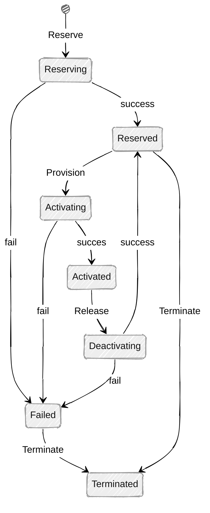

# nsi-aggregator-proxy

## Connection state machine

```mermaid
%%{init: {"look": "handDrawn", "theme": "neutral"}}%%
stateDiagram-v2
    [*] --> Reserving : Reserve
    state Reserving <<choice>>
    Reserving --> Reserved : success
    Reserving --> Failed : fail
    Failed --> Terminated : Terminate
    Reserved --> Activating : Provision
    state Activating <<choice>>
    Activating --> Activated : succes
    Activating --> Failed : fail
    Activated --> Deactivating : Release
    state Deactivating <<choice>>
    Deactivating --> Reserved : success
    Deactivating --> Failed : fail
    Reserved --> Terminated : Terminate
```
